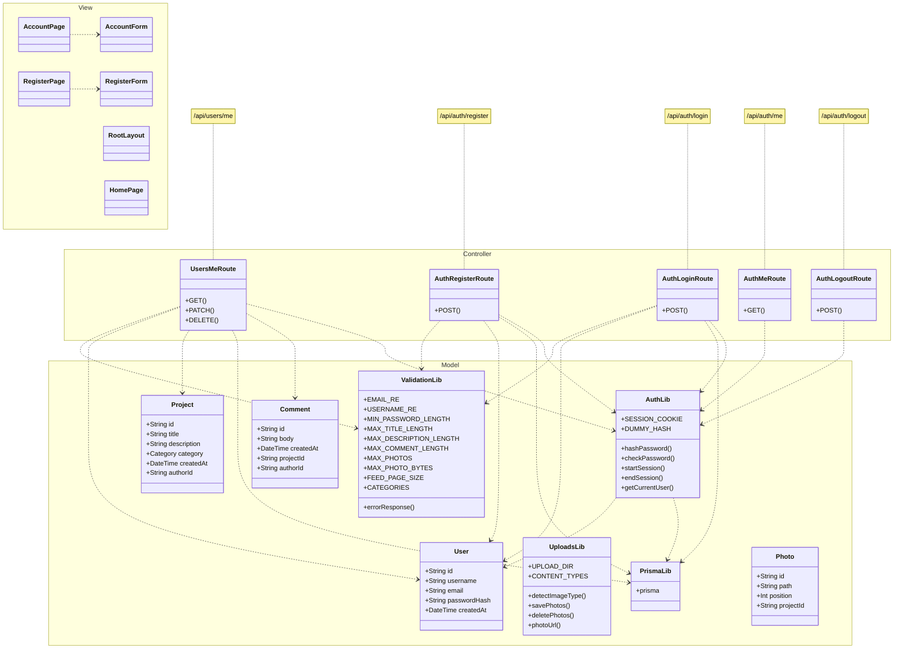

# Class diagram

This file is auto-generated by `npm run docs:classes` from the code in `src/` and `prisma/schema.prisma`. Do not edit it by hand.

```mermaid
classDiagram
    namespace Model {
        class AuthLib {
            +SESSION_COOKIE
            +DUMMY_HASH
            +hashPassword()
            +checkPassword()
            +startSession()
            +endSession()
            +getCurrentUser()
        }
        class PrismaLib {
            +prisma
        }
        class UploadsLib {
            +UPLOAD_DIR
            +CONTENT_TYPES
            +detectImageType()
            +savePhotos()
            +deletePhotos()
            +photoUrl()
        }
        class ValidationLib {
            +EMAIL_RE
            +USERNAME_RE
            +MIN_PASSWORD_LENGTH
            +MAX_TITLE_LENGTH
            +MAX_DESCRIPTION_LENGTH
            +MAX_COMMENT_LENGTH
            +MAX_PHOTOS
            +MAX_PHOTO_BYTES
            +FEED_PAGE_SIZE
            +CATEGORIES
            +errorResponse()
        }
        class User {
            +String id
            +String username
            +String email
            +String passwordHash
            +DateTime createdAt
        }
        class Project {
            +String id
            +String title
            +String description
            +Category category
            +DateTime createdAt
            +String authorId
        }
        class Photo {
            +String id
            +String path
            +Int position
            +String projectId
        }
        class Comment {
            +String id
            +String body
            +DateTime createdAt
            +String projectId
            +String authorId
        }
    }
    namespace View {
        class AccountForm
        class AccountPage
        class RootLayout
        class HomePage
        class RegisterForm
        class RegisterPage
    }
    namespace Controller {
        class AuthLoginRoute {
            +POST()
        }
        class AuthLogoutRoute {
            +POST()
        }
        class AuthMeRoute {
            +GET()
        }
        class AuthRegisterRoute {
            +POST()
        }
        class UsersMeRoute {
            +GET()
            +PATCH()
            +DELETE()
        }
    }
    note for AuthLoginRoute "/api/auth/login"
    note for AuthLogoutRoute "/api/auth/logout"
    note for AuthMeRoute "/api/auth/me"
    note for AuthRegisterRoute "/api/auth/register"
    note for UsersMeRoute "/api/users/me"
    AccountPage ..> AccountForm
    AuthLib ..> PrismaLib
    AuthLib ..> User
    AuthLoginRoute ..> AuthLib
    AuthLoginRoute ..> PrismaLib
    AuthLoginRoute ..> User
    AuthLoginRoute ..> ValidationLib
    AuthLogoutRoute ..> AuthLib
    AuthMeRoute ..> AuthLib
    AuthRegisterRoute ..> AuthLib
    AuthRegisterRoute ..> PrismaLib
    AuthRegisterRoute ..> User
    AuthRegisterRoute ..> ValidationLib
    RegisterPage ..> RegisterForm
    UsersMeRoute ..> AuthLib
    UsersMeRoute ..> Comment
    UsersMeRoute ..> PrismaLib
    UsersMeRoute ..> Project
    UsersMeRoute ..> User
    UsersMeRoute ..> ValidationLib
```
