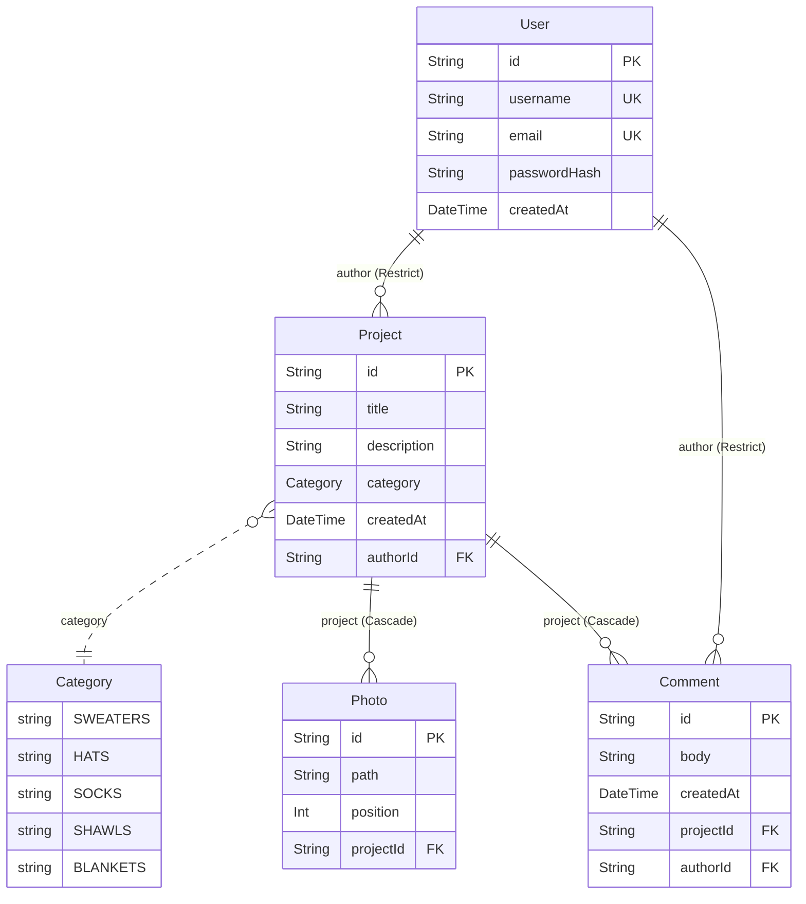

# Entity-relationship diagram

This file is auto-generated by `npm run docs:erd` from `prisma/schema.prisma`. Do not edit it by hand.

```mermaid
erDiagram
    User {
        String id PK
        String username UK
        String email UK
        String passwordHash
        DateTime createdAt
    }
    Project {
        String id PK
        String title
        String description
        Category category
        DateTime createdAt
        String authorId FK
    }
    Photo {
        String id PK
        String path
        Int position
        String projectId FK
    }
    Comment {
        String id PK
        String body
        DateTime createdAt
        String projectId FK
        String authorId FK
    }
    Category {
        string SWEATERS
        string HATS
        string SOCKS
        string SHAWLS
        string BLANKETS
    }
    Project }o..|| Category : "category"
    User ||--o{ Project : "author (Restrict)"
    Project ||--o{ Photo : "project (Cascade)"
    Project ||--o{ Comment : "project (Cascade)"
    User ||--o{ Comment : "author (Restrict)"
```
